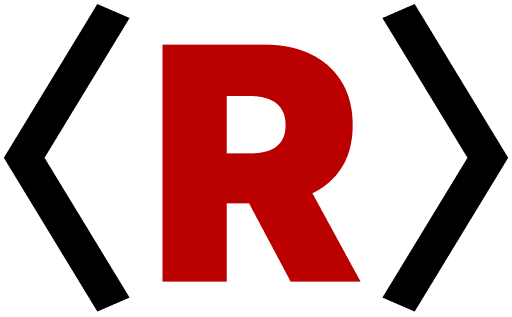

<br>

# Quickstart

Welcome to Rip, the **multilanguage universal runtime**! This guide will help you get up and running quickly.

## Installation

```bash
# Install dependencies (if any)
# For Bun:
bun install
# For Node.js:
npm install
```

## Generating a Parser

```bash
# Generate a parser from a grammar file
coffee rip.coffee grammar.coffee -o parser.js

# With optimization and analysis
coffee rip.coffee grammar.coffee --optimize --stats --verbose

# Interactive exploration mode
coffee rip.coffee grammar.coffee --interactive

# Production-ready parser (no console output)
coffee rip.coffee grammar.coffee --production -o parser.js
```

## Running Your First Program

```bash
rip my-program.rip     # Run Rip language (modern echo of CoffeeScript)
rip my-program.coffee  # Run CoffeeScript via language pack
rip my-program.py      # Run Python via language pack (future)
rip my-program.js      # Run JavaScript via language pack (future)
```

## Troubleshooting

- If you encounter issues, check your grammar file for syntax errors.
- Use the `--stats` and `--verbose` flags for more detailed output.
- For help, see the [full documentation](./README.md) or open an issue on GitHub.

## What to Read Next

Now that you're up and running, here's what to explore next:

- **[How It Works](./how-it-works.md)** - Understand the multilanguage universal runtime
- **[Language Packs](./language-packs.md)** - Learn about available languages and creating your own
- **[Grammar Authoring](./grammar-authoring.md)** - Create custom language grammars
- **[Runtime Engine](./runtime-engine.md)** - Deep dive into the universal parser

For a complete overview, check out the [Documentation Index](./README.md).

---

*Ready to build the future of programming languages?* 🚀